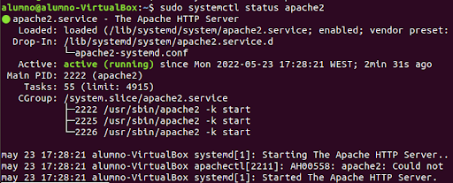
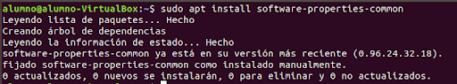
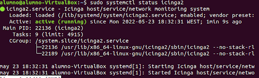

#Instalación Manual
### Preparación
Lo primero que tendremos que hacer será actualizar el sistema operativo. Para esto utilizaremos los comandos:

```
sudo apt update
``` 
y 
```
sudo apt upgrade
```

### Intalación
Lo primero que haremos será instalar instalando apache.
```
sudo apt install apache2
```


Una vez instalado, habilitaremos apache con el comando:
```
sudo systemctl enable apache2
```


Ahora, encenderemos el servicio:
``` 
sudo systemctl start apache2
```
Y comprobaremos que funciona con:
``` 
sudo systemctl status apache2
```


Ahora instalamos mariadb
``` 
sudo apt install mariadb-server mariadb-client
```


Lo habilitamos y lo iniciamos con los comandos y vemos su estado con los siguientes comandos respectivamente:
```
sudo systemctl enable mariadb
sudo systemctl start mariadb
sudo systemctl status mariadb
```


## Instalación de PHP
Ahora instalamos PHP.
```
sudo  apt install software-properties-common
```


Añadiremos el repositorio OndeJ que nos dará la última versión de PHP.
```
sudo add-apt-repository ppa:ondrej/php
```


Ahora instalaremos PHP con las dependencias necesarias para Icinga.
```
sudo apt install php php-curl php-gd php-mbstring php-xml php-xmlrpc php-soap php-intl php-zip php-cli php-mysql php8.0-common php8.0-opcache php-gmp php-imagick
```


Verificamos que PHP está instalado.
```
php -v
```


Ahora, instalaremos Icinga, lo primero que haremos será conseguir una key GPG.
```
curl https://packages.icinga.com/icinga.key | apt-key add -
```
Ahora usaremos el comando
```
sudo nano /etc/apt/sources.list.d/ondrej-ubuntu-php-bionic.list 
```
y añadiremos lo siguiente:


## Instalando Icinga2
Volveremos a utilizar el comando:
```
 sudo apt update
```
Ahora instalaremos Icinga2 con el siguiente comando:
```
sudo apt install icinga2 monitoring-plugins
```
Una vez instalado, lo habilitamos, lo iniciamos y comprobamos su estado con los comandos:
```
sudo systemctl enable icinga2
sudo systemctl start icinga2
sudo systemctl status icinga2
```


Ahora, instalaremos el la base de datos de Icinga conocido como IDO:
```
sudo apt install icinga2-ido-mysql
```
Ahora, configuraremos el SQL.


Hecho esto,  instalamos los plugins de monitorización
```
apt-get install monitoring-plugins
```
Ahora nos meteremos en la base de datos de MariaDB.
```
sudo mysql -u root -p
```


En cada línea escribiremos lo siguiente:
```
CREATE DATABASE icinga2 CHARACTER SET UTF8 COLLATE UTF8_BIN;
CREATE USER 'icinga2'@'%' IDENTIFIED BY 'alumno';
GRANT ALL PRIVILEGES ON icinga2.* TO 'icinga2'@'%';
quit;
```
Hecho esto, escribiremos el siguiente comando para comprobar que está creada la base de datos:
```
sudo mysql -u root -p icinga2
```
Comprobado esto, haremos lo siguiente para importar la base de datos usando el siguiente comando:
```
sudo mysql -u root -p icinga2db < /usr/share/icinga2-ido-mysql/schema/mysql.sql
```
## Activando el módulo IDO MySQL
Los maquetes IDO vienen con un fichero de configuración llamado ido-mysql.conf. Necesitaremos entrar en este archivo y modificar los detalles de la conexión con la base de datos.
Para ello usaremos el comando:
```
sudo nano /etc/icinga2/features-available/ido-mysql.conf
```
Configuraremos el fichero con lo anteriormente configurado.


Después de esto,reiniciamos icinga.
```
service icinga2 restart
```
Ahora, instalaremos la interfaz web de Icinga2:

Para ello, instalaremos los siguientes paquetes:
```
apt-get -y install apache2 php libapache2-mod-php php-cli php-opcache php-gd
```
```
apt-get -y install php-mysql php-mbstring php-xml php-gd php-json php-curl
```
```
apt-get -y install php-bcmath php-ldap php-intl php-readline 
```
Ahora, nos meteremos en el fichero php.ini para cambiar la hora.
```
nano /etc/php/7.2/apache2/php.ini
```
```
date.timezone = Europe/Madrid
```
Hecho esto, reiniciamos apache
```
service apache2 restart
```
Ahora, entramos en 
```
mysql -u root -p.
```

Pondremos lo siguiente:
```
CREATE DATABASE icingaweb_db CHARACTER SET UTF8 COLLATE UTF8_BIN;
CREATE USER 'icingaweb_db'@'%' IDENTIFIED BY 'alumno';
GRANT ALL PRIVILEGES ON icingaweb_db.* TO 'icingaweb_db'@'%';
quit;
```
## Instalación de IcingaWeb
```
apt-get install icingaweb2
```
Terminado de descargar, volveremos a usar:
```
service apache2 restart
```
Ahora, generamos un token de instalación
```
icingacli setup token create
The newly generated setup token is: 90824bb238b3f11d
```


Ahora, nos meteremos en la ip que saquemos mediante nuestro equipo y pondremos en el navegador:
```
http://10.0.2.15/icingaweb2
```
Escribiremos nuestro token y daremos a siguiente.


En las siguientes dos pantallas (Módulos y requisitos), daremos click a siguiente.

En la pantalla de autentificación elegiremos la opción base de datos.

En la siguiente pestaña nos pedirá los recursos de la base de datos, escribiremos lo siguiente.


Daremos a siguiente en la de autentificación.
En la pestaña de administración escribiremos el usuario admin y la contraseña que queramos.


Seguiremos dándole a siguiente hasta llegar a lo siguiente.


Validamos y seguiremos dando a next hasta finalizar.


### [Volver a la leyenda](../index.md)               [Siguiente paso](instalacion2.md)
