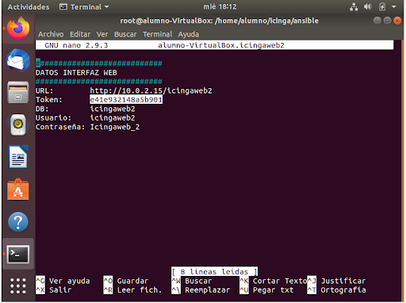
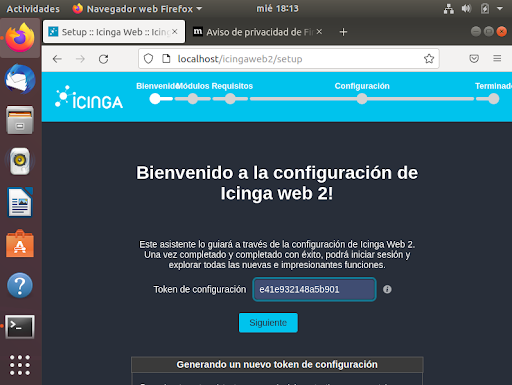
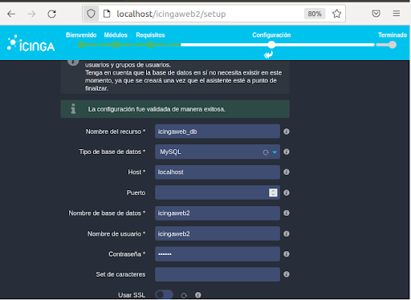
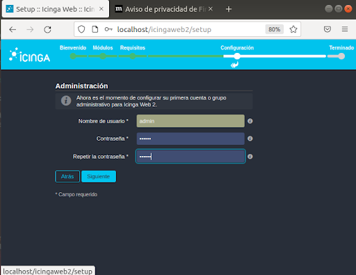
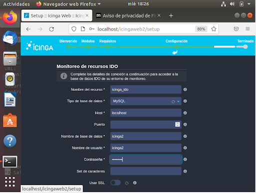
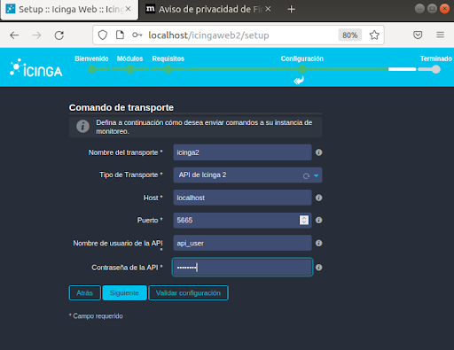
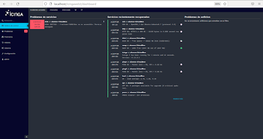

# Instalación con Ansible

Lo primero para instalar Icinga con Ansible es utilizar el comando:
```
git clone https://github.com/asir-idp/icinga.git
```
Cuando termine de ejecutarle el git clone, nos meteremos en la siguiente carpeta
```
cd icinga/ansible
```
Dentro de esta, usaremos el siguiente comando que instalará Icinga:
```
./instalar-maestro.sh
```
## Configuración de Icinga mediante Ansible
Una vez instalado iremos al fichero hostname.icingaweb2 y cogeremos el token.



Escribiremos el token en su sitio:



En la pestaña de recursos, la llenaremos con lo siguiente:



Proseguiremos llenando las siguientes pestañas con la información de las capturas.







Hecho esto, se debería de terminar la configuración de Icinga.



### [Volver a la leyenda](../index.md)
### [Siguiente paso](monitorizacion.md)
