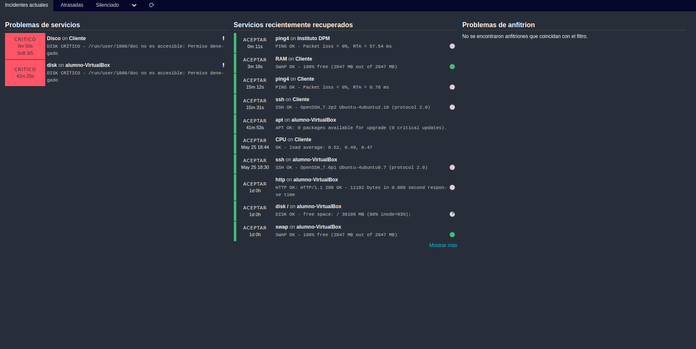

# Monitorización
## Configuración
##### Nota
Para que los cambios sucedan tendremos que utilizar el comando:
```
systemctl restart icinga2
```
Lo primero que haremos será ir al fichero hosts.conf en la ruta:
```
/etc/icinga2/conf.d/hosts.conf
```
Dentro de este, escribiremos:
```
/*Para conectar con el cliente*/
object Host "Cliente" {
    import "generic-host"
    address = "10.0.2.15"
}
/*Para monitorizar la CPU del cliente*/
object Service "CPU" {
  import "generic-service"
  host_name = "Cliente"
  check_command = "load"
}
/*Para monitorizar la RAM del cliente*/
object Service "RAM" {
  import "generic-service"
  host_name = "Cliente"
  check_command = "swap"
}
/*Para monitorizar el disco del cliente*/
object Service "Disco" {
  import "generic-service"
  host_name = "Cliente"
  check_command = "disk"
}
/*Para monitorizar la página web del instituto*/
object Host "Instituto DPM" {
    import "generic-host"
    address = "81.88.48.71"
}
```
Ahora entraremos en services.conf en la ruta:
```
/etc/icinga2/conf.d/services.conf
```
Escribiremos:
```
object Service "ssh" {
    import "generic-service"
    host_name = "Cliente"
    check_command = "ssh"
}
```
##### Captura de la monitorización:



##### Nota
Los errores de disco son errores de la aplicación y no son corregibles. 

### [Volver a la leyenda](../index.md) [Siguiente paso](notificacion.md)
