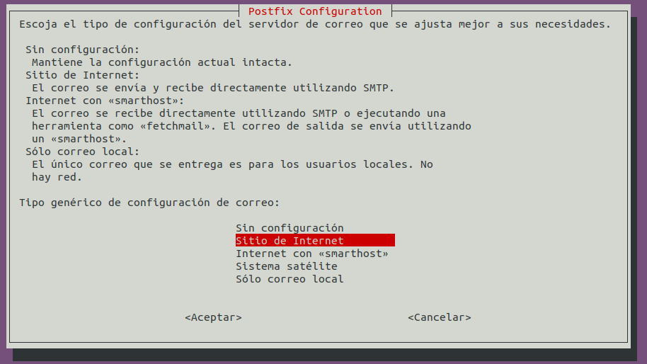
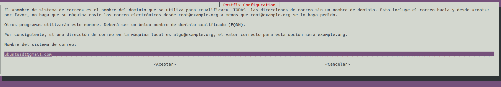
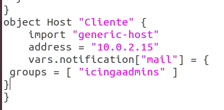
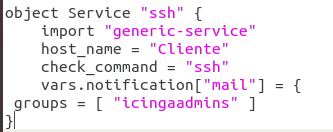
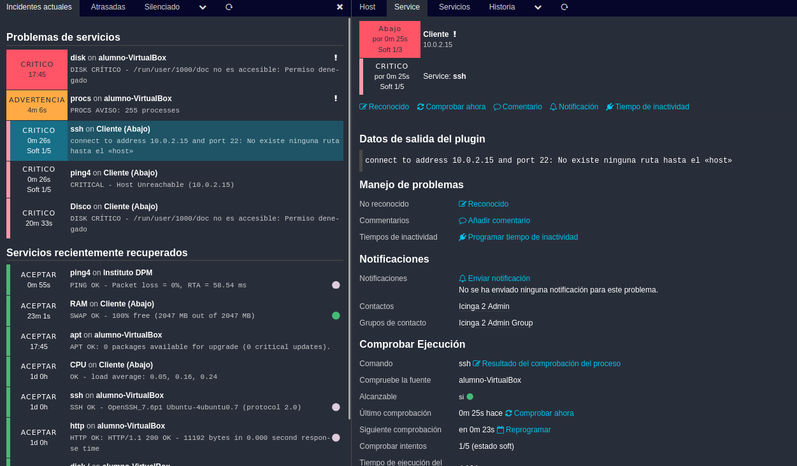
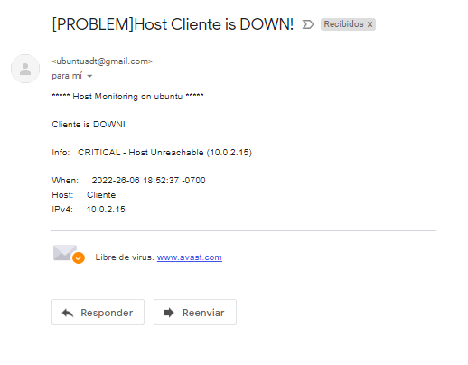

# Notificación de fallo en el servidor
Lo primero que debemos hacer es instalar postfix mailutils mediante el comando:
```
sudo apt-get install postfix mailutils
```
Se abrirá el asistente y seguiremos esto mediante las siguientes capturas



Pondremos el correo que queremos que tenga el servidor



Una vez terminada la instalación, iremos al archivo
```
/etc/icinga2/conf.d/users.conf
```
El fichero deberá de quedar de la siguiente forma:
```
/**
 * The example user 'icingaadmin' and the example
 * group 'icingaadmins'.
 */

object User "icingaadmin" {
  import "generic-user"

  display_name = "Icinga 2 Admin"
  groups = [ "icingaadmins" ]

  email = "sergiodtd@gmail.com"
}

object UserGroup "icingaadmins" {
  display_name = "Icinga 2 Admin Group"
}
```
Para recibir notificaciones de un servicio determinado pondremos la línea de comando siguiente dentro de hosts.conf y services.conf:
```
vars.notification["mail"] = {
 groups = [ "icingaadmins" ]
}
```
Ejemplo de esto en los archivos:
En hosts.conf



En services.conf



##### Prueba de funcionamiento
Para esta, apagaré el equipo para comprobar que me manda un correo.



Email recibido



### [Volver a la leyenda](../index.md)
